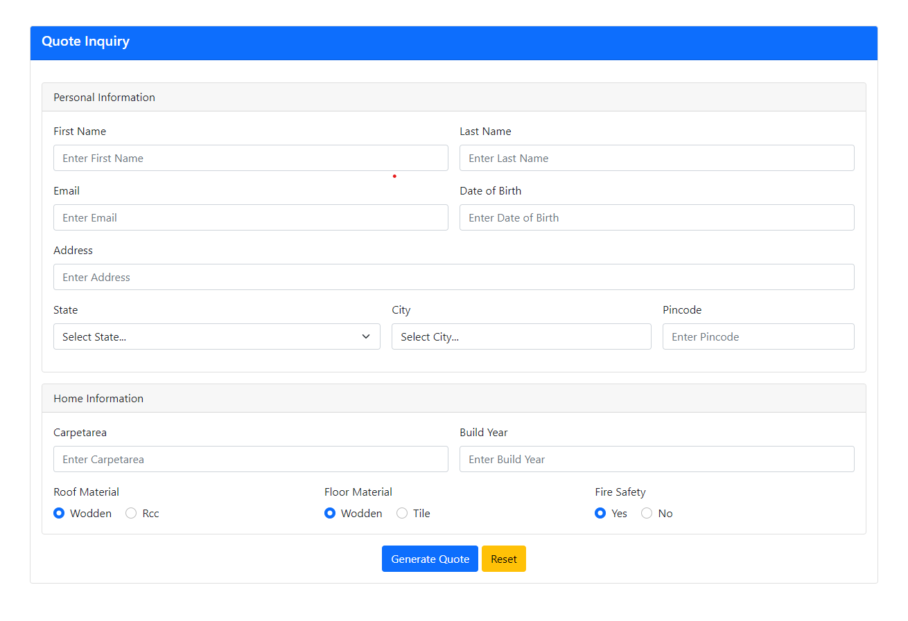

# estate-quote-inquiry

## Objective of this application is to collect the information from the user and calculate best offer/quote for the user according the condition of their given details, from that details give best quote to user.

- the application also contains some validation to prevent system from breaking for edge cases
- I've added logger functionality so that it log each event of the user such as quote form filled, quote generation, view offer accept offer etc...

- quote inquiry form

